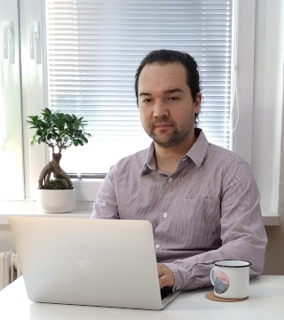
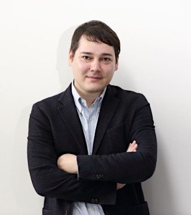
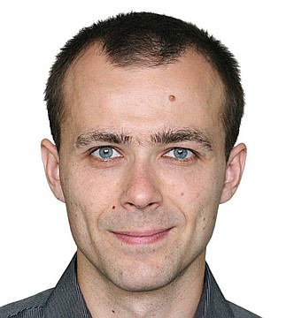

  

# O&nbsp;Java Akademii

## Představení kurzu

Cíl kurzu:

> Posunout se ve své programátorské kariéře z&nbsp;úplného začátečníka na úroveň někoho, kdo by si mohl troufnout na pozici juniorního programátora. 

Nebude to ale zadarmo &mdash; určitě totiž nebude stačit si odsedět samotnou lekci, ale budeš si muset:

- opakovat a procvičovat probranou látku,

- pracovat na projektech,

- **ptát se, když ti něco nepůjde** 

> Čtvrt hodiny tomu věnuj sám. Když to stále nejde, zeptej se!

Během dvanácti tříhodinových lekcí si postupně od úplných základů projdeme tvorbu programů v Javě, kde si vše zároveň ukážeme i na příkladech, seznámíme se nástroji, které se při vývoji aplikací bežně používají, projdeme si spolu celý vývojový cyklus aplikace, ukážeme si, jak se testuje a všechny tyto nově nabyté znalosti nakonec dostanete šanci uvést do praxe, když si na společném projektu vyzkoušíte, jak se vám podařilo učivo zvládnout.

---

## Představení lektorů

Na tomto kurzu se vám budou věnovat tři lektoři. Prvními šesti lekcemi vás provede [Martin](#Martin Šimůnek), ve zbytku lekcí se budou střídat [Marek](#marek-nedbal) a&nbsp;[Lukáš](#lukas-horak). Na Slacku nás najdete všechny tři.

### Marek Nedbal

 

- Živím se jako software engineer a krom krátkého extempore na začátku mé programátorské kariéry programuji již šestým rokem právě v Javě - momentálně pro společnost, o které v rámci Java kurzu ještě nekolikrát uslyšíte - <b>Oracle</b>

- Učení je mým koníčkem, který jsem objevil před rokem a máloco mě potěší tak, jako radost studenta, když ho drobnými radami doštouchám k tomu, aby si na řešení problému, na kterém se zasekl, přišel skoro sám

### Lukáš Horák

  

- V&nbsp;současné době pracuji jako consultant ve společnosti Adastra, ale s&nbsp;programováním jsem začal již před dlouhou dobou na základní škole. Měl jsem šteští, že díky práci jsem mohl pracovat v různých kulturách a setkat se s množštvím zajímavých lidí, od kterých jsem se sám mohl hodně naučit. Nyní je idealní příležitost znalosti předat dalším lidem a idealně nadchnout nové studenty.

### Martin Šimůnek

 

- Vystudoval jsem softwarové inženýrství na FEL ČVUT v&nbsp;Praze, ale také bakalářský obor učitelství odborných předmětů. 

- Od roku 2006 působím jako středoškolský učitel a&nbsp;učím žáky zvládat programování, operační systémy, sítě a&nbsp;další IT předměty na oboru Informační technologie v&nbsp;rámci Obchodní akademie Uherské Hradiště.

- Budu se vám věnovat v&nbsp;prvních 6&nbsp;lekcích a&nbsp;mým úkolem bude provést vás úplnými začátky.

---

## Struktura lekce

Návrh:

1. tři části cca pro 50&nbsp;minutách
2. mezi nimi vždy cca 10&nbsp;minut pauza

Souhlasíte? ;)

---

## Jak klást dotazy

- **Zapni si mikrofon a&nbsp;prostě se zeptej ;)**

- Zvedni ruku pomocí ikonky

- Napiš zprávu do Slacku

---

## Jak se učit
Je samozřejmě jen na vás, jak s&nbsp;Java Akademií naložíte. Jste naši zákazníci!

Abychom společně dosáhli nejlepších výsledků, navrhujeme vám následující „pravidla“:
1. Ptejte se hned, jak narazíte na problém!
	- Není důležité, jak „hloupý“ ti tvůj problém připadá. Neexistují hloupé dotazy. Pokud ti něco není jasné, je dotaz vždycky na místě!
2. Sledování je zábavné, učíte se ale psaním!
	- Víme, že je příjemné si sednout a&nbsp;sledovat, jak to lektorovi krásně jde (nebo třeba někdy nejde).
	- Pokud to ale s&nbsp;učením myslíte vážně, musíte si věci zkoušet sami!
	- Je to stejné jako s&nbsp;běháním maratonu. Můžete si poslechnout pět videokurzů o tom, jaké boty používat, jak se připravovat, jakou výživu zvolit.
	- A&nbsp;skutečně, najdete lidi, kteří vám budou hodiny zasvěceně vyprávět, jak se připravit na maraton. Ale až se postavíte na start, rozhoduje počet naběhaných kilometrů!
	- Je jen na vás, jestli se chcete stát „zdatnými teoretiky“, nebo se skutečně naučit psát!
3. Nevyhovuje vám něco? Řekněte to!
	- Jsme tady pro vás. Nebojte se říci si, co byste chtěli nebo co by vám pomohlo.
	- Věnovali jsme přípravě hodně času, ale neznáme vás a&nbsp;vaše potřeby tak, jako se znáte vy. Když nám dáte vědět, budeme se snažit akademii přizpůsobit vašim potřebám a&nbsp;vašemu tempu. 
	- Navíc nám tím pomůžete lépe pochopit, co účastníci akademie potřebují!

---

## Zdroje
 - [Stránka Java akademie na learn.engeto.com](https://learn.engeto.com/)
 - [On-line kurz Java#1](https://learn.engeto.com/cs/kurz/java-1-uvod-do-programovani/lekce)

---

[Zpět na přehled akademie](https://github.com/ENGETO-Java-Akademie-2021-07-12/intro)